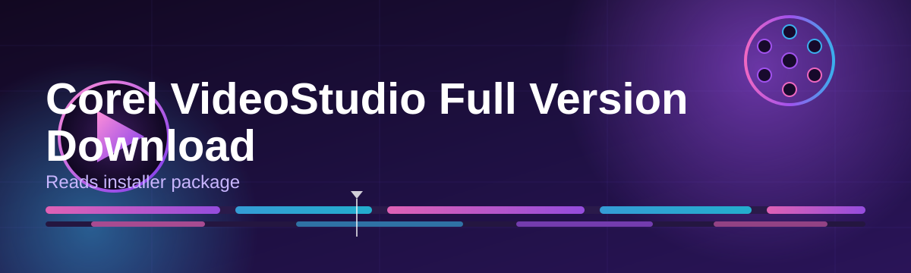

# corel-videostudio-installer-assistant 🎬✨

  

*A friendly companion that guides you from "I want Corel VideoStudio" to "I'm editing my first timeline" — no guesswork, no dead links.*

  

## 🧭 What This Is NOT

Let's clear the air before anything else, friend.

> [!IMPORTANT]
> This project is **not** a pirated copy, **not** a modified build, and **not** a substitute for a legitimate Corel VideoStudio license. It does not unlock paid features and it does not tamper with activation systems in any way.

What it **is**, though, is a small, well-organized *assistant* — a wrapper of sorts around the whole discovery-and-setup journey. Think of it as the friend who already went through the confusing download page, the mismatched mirrors, and the "which version do I even need" spiral, and came back with a clean map for you.

## 🌱 Overview

Corel VideoStudio has been a staple in the world of consumer and semi-pro video editing for a long time — it's the software people reach for when they want something more capable than a phone app, but far less intimidating than a full NLE suite built for Hollywood colorists. The trouble is, actually finding a trustworthy, up-to-date path for a **Corel VideoStudio full version download** in 2026 can feel like navigating a maze of outdated blog posts, broken mirrors, and pages that don't tell you what edition or build you're actually getting.

That's the itch this repository scratches. `corel-videostudio-installer-assistant` exists as a **landing-page companion and orientation layer** — it doesn't host installers itself, it doesn't repackage anything, and it doesn't touch licensing internals. Instead, it curates the *journey*: pointing you toward the official-style landing page, explaining system requirements in plain language, walking through setup expectations, and giving you a troubleshooting playbook so you're not left guessing when something looks unfamiliar.

Who is this for? Hobbyist editors piecing together family videos, YouTubers who want a lightweight but capable timeline tool, students learning the basics of transitions and color correction, and honestly — anyone who's tired of sketchy download experiences and just wants a clear, documented path. If that sounds like you, pull up a chair.

  

---

## 🎛️ What's Inside The Toolbox

Here's what this assistant actually gives you, laid out with fresh eyes rather than the usual feature-list fatigue.

- **Guided landing-page routing** — instead of hunting through search results, you get one consistent doorway to the current release page, every time.

- **Plain-language requirement checks** — before you even click download, you'll know if your machine is going to be happy or grumpy about it.

- **Version-awareness notes** — 2026 builds behave differently than older ones; we call out what's changed so you're not surprised mid-install.

- **Troubleshooting playbook** — a running log of the weird little issues people hit (driver quirks, render hiccups, missing codecs) and how they got past them.

- **UI orientation cheatsheet** — because a fresh install with an unfamiliar layout can eat an hour of your evening if nobody points out where things live.

- **Community-sourced tips** — real notes from real editors, not marketing copy.

- **Lightweight footprint** — the assistant itself is just documentation and a landing page; it doesn't install background services or nag you with popups.

- **No dependency spaghetti** — you won't need to wrangle separate runtimes or libraries just to get moving.

> [!TIP]
> If you're editing on a laptop with integrated graphics, skim the **System Requirements** table below before you download — it'll save you a confusing first render.

---

## 🚀 How To Get Started

Getting rolling here is intentionally boring — in the best way.

1. **Visit the landing page** using the download button above or below — that's the single source of truth for the current release.

2. **Download the installer package** from the page. It's a standard Windows executable; no bundled extras, no surprise toolbars.

3. **Run the installer** and follow the on-screen prompts. Pick your install directory, accept the license terms, and let it do its thing.

4. **Launch Corel VideoStudio** from your Start Menu, sign in or activate per the on-screen instructions, and start your first project.

> [!NOTE]
> First launch can take a little longer than expected while the app builds its initial cache and checks for updates. That's normal — grab a coffee.

---

## 🖥️ System Requirements

Before you commit to a download, here's the honest breakdown of what your machine needs to handle Corel VideoStudio comfortably in 2026.

| OS | RAM | Disk Space |
|---|---|---|
| Windows 10 (64-bit, latest updates) | 8 GB minimum | 6 GB free (SSD recommended) |
| Windows 11 (64-bit) | 16 GB recommended for 4K editing | 10+ GB free for cache and render output |
| Windows 11 (ARM builds, limited support) | 16 GB | 10+ GB free |

> [!WARNING]
> Editing 4K footage with less than 8 GB of RAM is technically possible but is a bit like sprinting in flip-flops. Expect stutters during preview scrubbing.

<strong>💽 A note on storage type</strong>

Spinning hard drives will work, but timeline scrubbing and render caching feel noticeably smoother on an SSD. If you're doing anything beyond simple cuts, treat SSD space as a soft requirement rather than a nice-to-have.

---

## ⚙️ How It Works

The assistant's workflow is deliberately simple — five steps, no hidden magic.

1. You arrive here, curious about a Corel VideoStudio full version download.
2. You click through to the landing page for the current build.
3. You confirm your system meets the requirements table above.
4. You download and run the official-style installer package.
5. You launch the app and start editing.

> [!TIP]
> Bookmark the landing page link rather than re-searching each time — release pages get refreshed periodically as builds update.

---

## 🔧 Troubleshooting Corner

Real questions, gathered from people who went through this exact journey.

**Q: The installer says my system doesn't meet requirements, but I have 8 GB of RAM. What's going on?**
A: Some background apps reserve RAM aggressively. Close browser tabs and heavy apps before installing, then re-check.

**Q: Video preview is stuttering during editing, even though the file plays fine elsewhere.**
A: This is usually a hardware acceleration mismatch. Check your graphics driver version and update it — VideoStudio leans on GPU decoding for smooth scrubbing.

**Q: The app opens but the interface looks broken or oddly scaled.**
A: Windows display scaling above 150% can confuse older UI renderers. Try setting scaling to 125% or enable the app's high-DPI compatibility option in its properties.

**Q: My download seems to stall partway through.**
A: Pause and resume if your browser supports it, or try a different network — some corporate/school networks throttle large file transfers.

**Q: I installed it but can't find where projects are saved.**
A: Default project locations sit under your Documents folder in a VideoStudio-named subdirectory unless you changed it during setup.

**Q: Audio is out of sync after rendering.**
A: This is often a frame-rate mismatch between your source footage and your project settings. Match your project's frame rate to your primary footage before rendering.

---

## 🎨 UI, UX & Little Quality-of-Life Details

The interface rewards a little muscle memory. Here's what's worth knowing early.

| Action | Shortcut |
|---|---|
| Split clip at playhead | `Ctrl + Shift + S` |
| Play / Pause preview | `Space` |
| Zoom timeline in/out | `Ctrl + Scroll` |
| Save project | `Ctrl + S` |
| Undo / Redo | `Ctrl + Z` / `Ctrl + Y` |

- **Themes**: Dark mode is the default in 2026 builds, easing eye strain during long sessions; a lighter theme is available in preferences for daylight editing.
- **Customizable panels**: Drag panel edges to resize preview vs. timeline space — useful on smaller laptop screens.
- **Snap-to-grid**: Timeline snapping can be toggled for frame-precise trimming versus loose freeform edits.

> [!NOTE]
> If shortcuts feel unresponsive, check that no other running app is intercepting the same key combination — a common culprit is screen-recording software.

---

## 🤝 Contributing & Community

This project grows because people share what they learn. Found a requirement that's outdated? Hit a troubleshooting scenario not listed here? Open an issue or a pull request — plain, clear write-ups are always welcome, no need for polished prose.

- Star the repo if this saved you some hunting-around time.
- Open an issue for anything unclear or outdated.
- Submit a PR for troubleshooting entries you've verified yourself.

  

---

## 📜 License

Released under the [MIT License](LICENSE), 2026. Use it, fork it, adapt it — just keep the credit where it's due.

---

## ⚠️ Disclaimer

> [!CAUTION]
> This repository is an independent, community-maintained informational assistant. It is not officially affiliated with, endorsed by, or sponsored by Corel Corporation. All product names, logos, and brands mentioned belong to their respective owners. Always download software from sources you trust and verify authenticity before installing.

---

  

